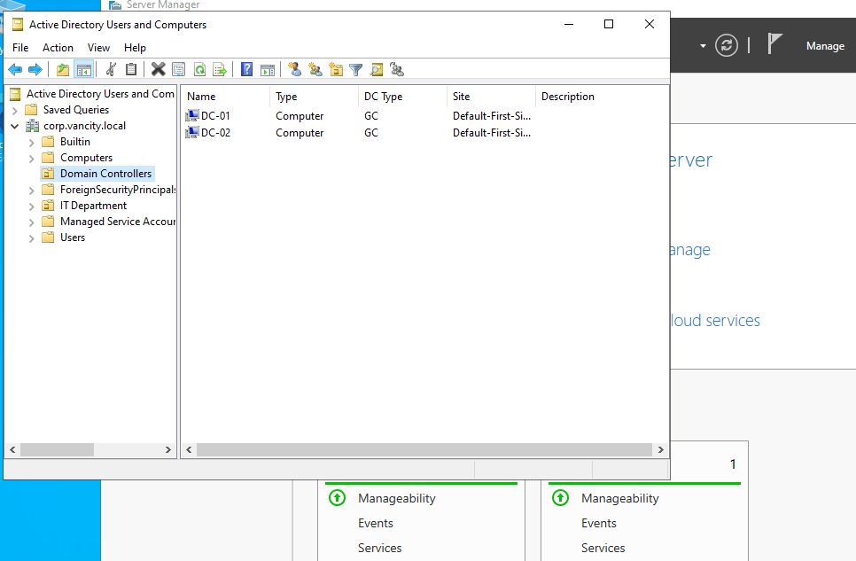
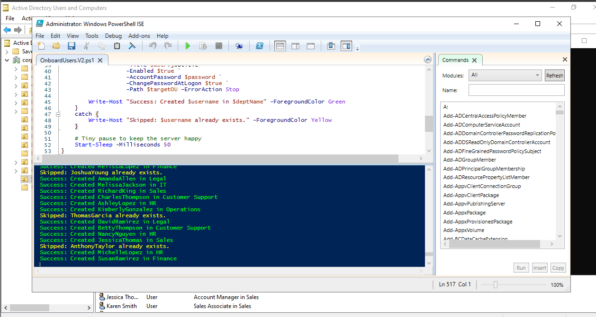
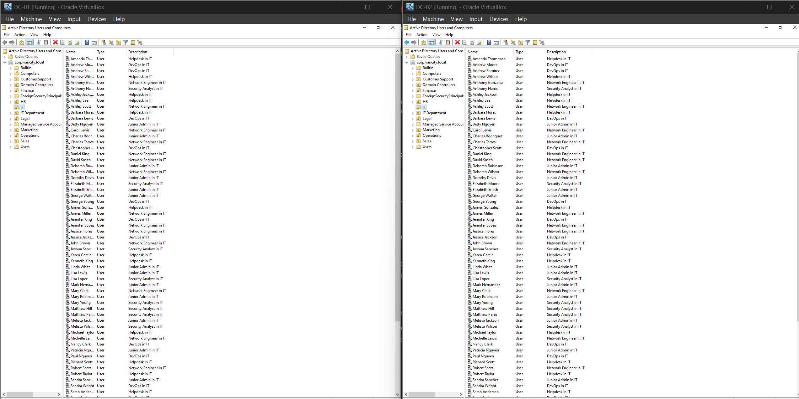
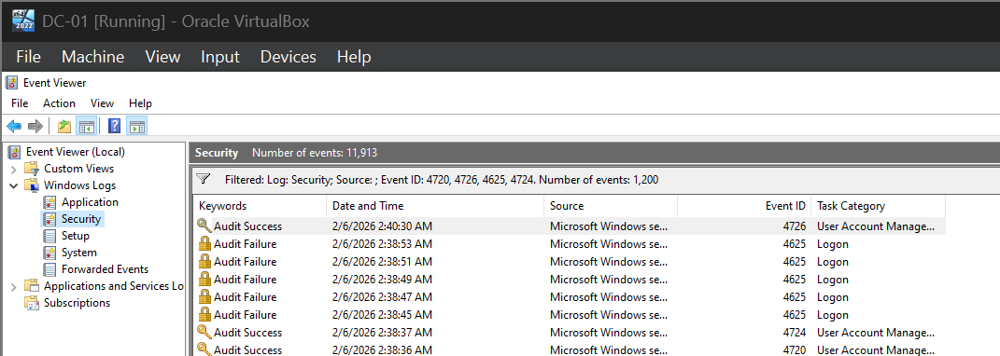
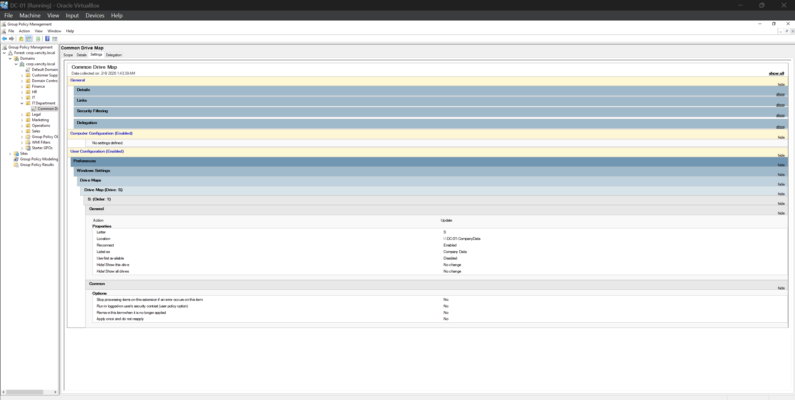

# 🛡️ Enterprise Identity, Security & Automation Lab

## 📌 Executive Summary
Designed and deployed a resilient, enterprise-grade Identity Infrastructure using **Windows Server 2022**. The project simulated a mid-sized organization (`corp.vancity.local`) undergoing a rapid expansion.

## 📸 Project Gallery

### Infrastructure & Redundancy
*Dual Domain Controllers (DC-01 & DC-02) syncing via Active Directory Sites & Services.*

### Automation Logic
*PowerShell script utilizing logic loops to onboard 270+ users in under 60 seconds.*

### Directory Structure (Scale)
*Verified onboarding of 270+ users across multiple departments (HR, IT, Sales).*

### Security Hardening (Lockout Policy)
*Account Lockout Threshold set to 5 attempts to prevent Brute Force attacks.*

### Forensic Monitoring (Audit Logs)
*Event Viewer capturing "Audit Failure" (Event 4625) for security analysis.*

### Operational Excellence (GPO)
*Group Policy Configuration mapping the S: Drive for all employees.*

